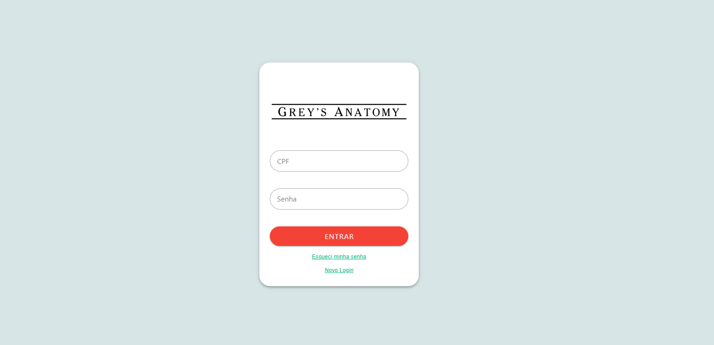
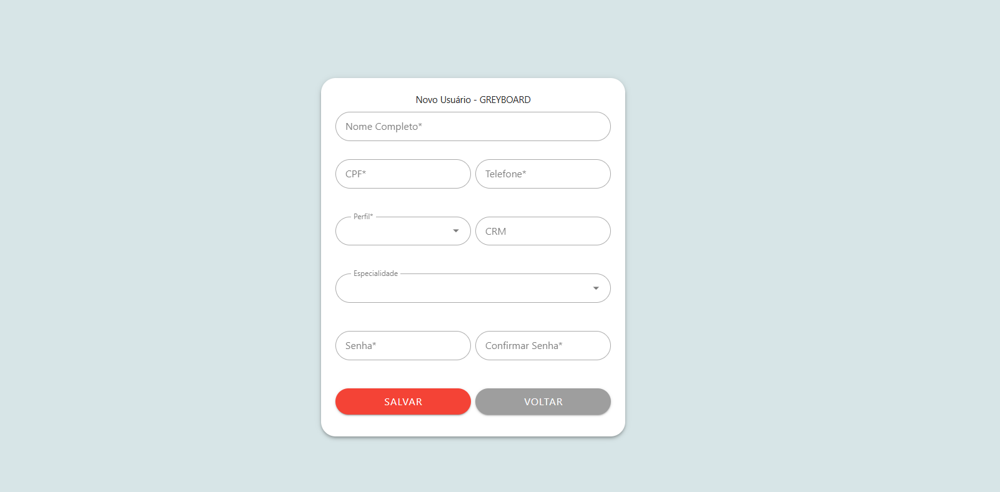

# grey-board-project

O quadro de cirurgia mais famoso do mundo, agora no formato digital!

## About

Esse mini projeto foi desenvolvido com o intuito de colocar em prática minhas habilidades com Vue 3 e Pinia

## Preview:





## Project Setup

```sh
npm install
```

### Compile and Hot-Reload for Development

```sh
npm run dev
```

### Type-Check, Compile and Minify for Production

```sh
npm run build
```
